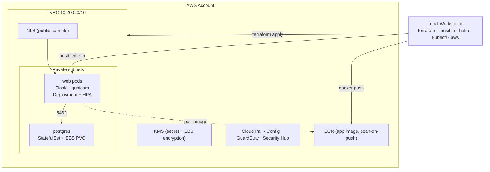

# Architecture

## Overview

A two-tier web application:

- **Tier 1 – Web:** a Python **Flask** contact form served by **gunicorn**,
  stateless, horizontally scalable.
- **Tier 2 – Data:** a **PostgreSQL** database (StatefulSet with a persistent
  volume) that stores form submissions.

The *identical* container image and Helm chart run in two environments:

1. **Local RKE2** development cluster.
2. **AWS EKS**, provisioned by Terraform and deployed by Ansible.

## Workflow (local workstation → AWS)

```
 Local Workstation
        |
        |  (1) terraform apply        provisions infra as code
        v
 AWS Infrastructure  ── VPC / subnets / NAT / EKS / IAM / KMS / ECR / CIS controls
        |
        |  (2) ansible-playbook       repeatable, idempotent app deploy
        v
     AWS EKS   ── namespace, RBAC, secret, Helm release
        |
        v
 Contact-Form Application (Flask + PostgreSQL)
```

## AWS target topology

```
                       Internet
                          │
                 ┌────────▼─────────┐
                 │  NLB (public)    │   internet-facing, HTTP:80
                 └────────┬─────────┘
      VPC 10.20.0.0/16    │
   ┌──────────────────────┼──────────────────────────────┐
   │  Public subnets (per AZ)   [NLB, NAT GW]             │
   │   10.20.0.0/20 (az-a)   10.20.16.0/20 (az-b)         │
   │        │  NAT egress                                  │
   │  ┌─────▼──────────────────────────────────────────┐ │
   │  │ Private subnets (per AZ)  [EKS worker nodes]    │ │
   │  │  10.20.32.0/20 (az-a)  10.20.48.0/20 (az-b)     │ │
   │  │                                                  │ │
   │  │   ┌───────────────┐        ┌──────────────────┐ │ │
   │  │   │ web pods       │──5432─▶│ postgres pod     │ │ │
   │  │   │ (Deployment,   │        │ (StatefulSet +   │ │ │
   │  │   │  HPA 2–6)      │        │  EBS gp3 PVC)    │ │ │
   │  │   └───────────────┘        └──────────────────┘ │ │
   │  └──────────────────────────────────────────────────┘
   └──────────────────────────────────────────────────────┘
        EKS control plane (managed) · secrets encrypted with KMS
        Control-plane logs → CloudWatch
```

## Mermaid (renders on GitHub)



## Key design decisions

| Decision | Rationale |
|---|---|
| Same image + Helm chart for both clusters | Guarantees dev/prod parity; only `values-*.yaml` differ. |
| Workers in **private** subnets, NLB in public | Nodes are never directly internet-reachable. |
| **NLB** via `type: LoadBalancer` (not ALB Ingress) | EKS's built-in cloud controller provisions it — no extra controller to install/maintain. |
| **Managed node group** | AWS handles AMI patching, lifecycle, draining. |
| **KMS envelope encryption** for K8s secrets | Secrets encrypted at rest in etcd (FSBP EKS.3). |
| **IRSA / OIDC provider** created | Lets add-ons/workloads get scoped IAM without node-wide creds. |
| Secrets generated at deploy time by Ansible | No credentials in git or images. |
| PostgreSQL in-cluster (not RDS) | Matches the email's "two-tier app"; documented as swappable for RDS. |
| Single NAT gateway by default | Cost control for a dev assignment; `single_nat_gateway=false` for HA. |
| Terraform split into `vpc/iam/eks/security` modules | Modular, reusable, independently testable. |
| AWS EKS over Azure AKS | See [platform-decision-eks-vs-aks.md](platform-decision-eks-vs-aks.md) — the spec is AWS-specific. |

## Production note

For a real production system the database tier would be **Amazon RDS for
PostgreSQL** (Multi-AZ, automated backups, managed patching) instead of an
in-cluster StatefulSet. The assignment's email specifies a two-tier app with a
PostgreSQL database, so it is deployed in-cluster here; switching to RDS is a
values/Terraform change, not an application change (the app only reads
`DB_HOST/DB_PORT/DB_USER/DB_PASSWORD`).
